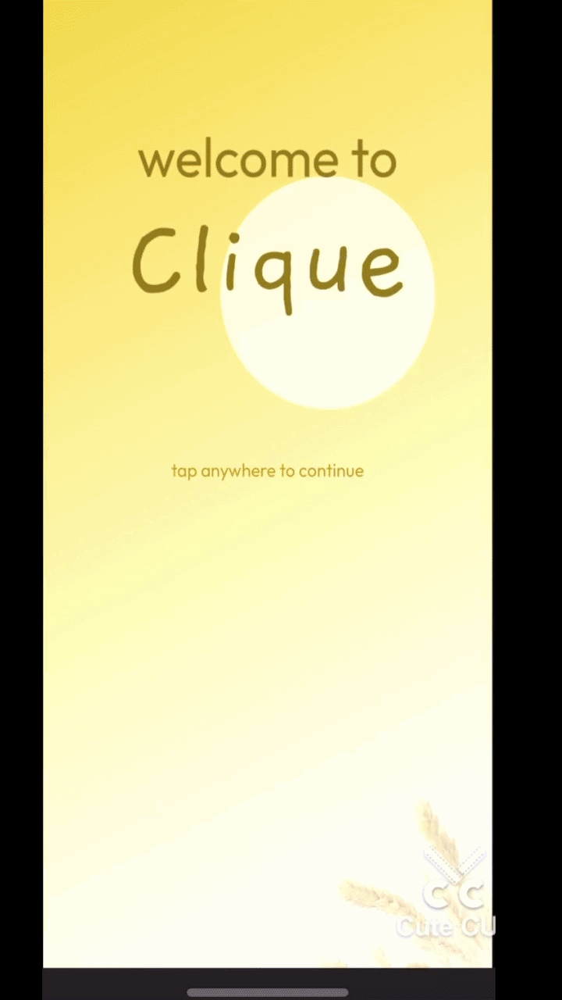
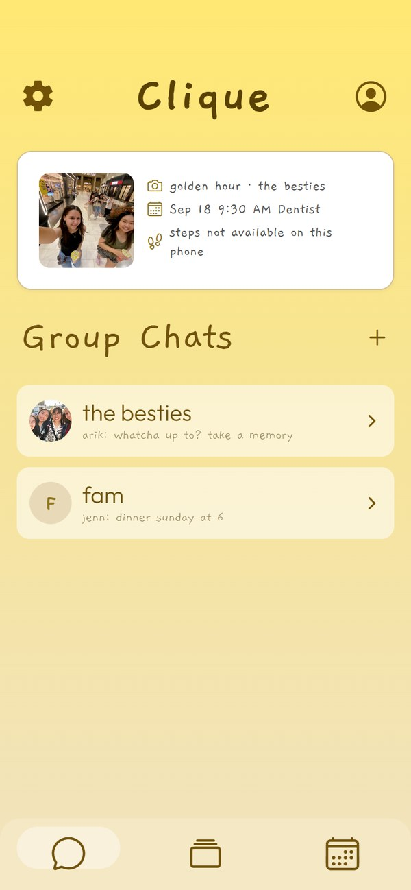
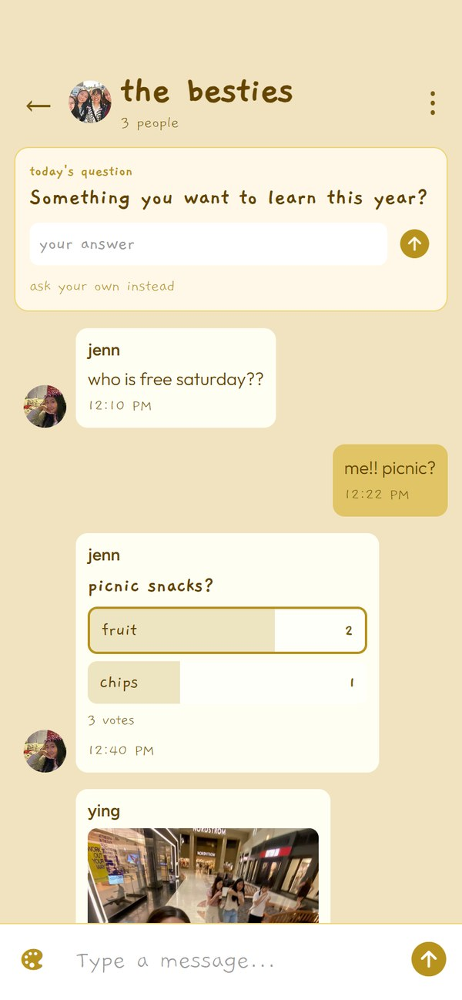
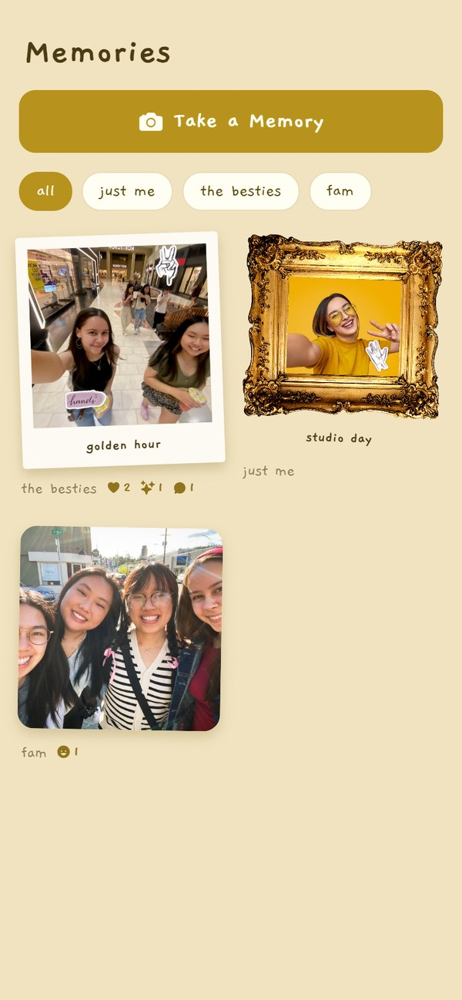
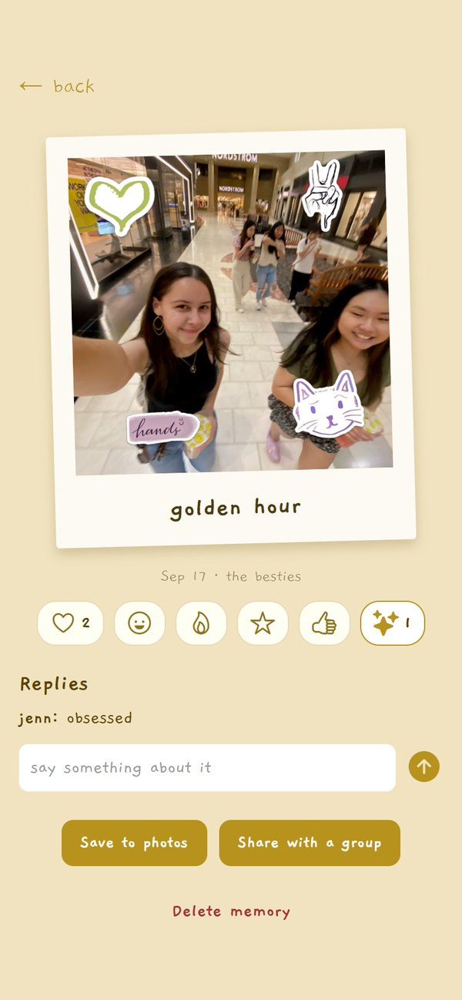
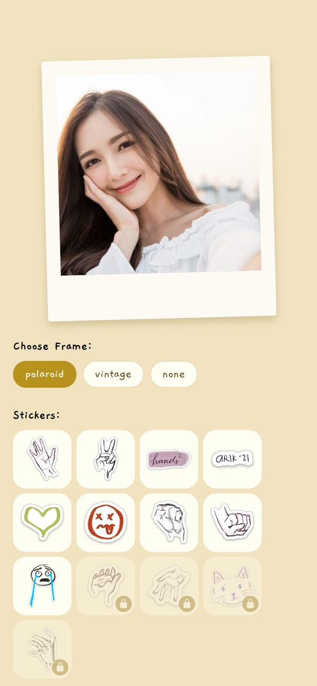
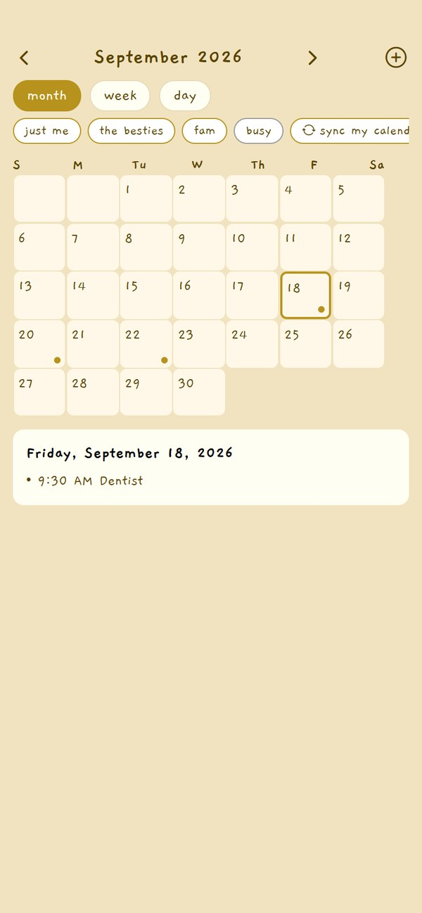

# Clique

Clique is what happens when a group chat, a shared camera roll, and a calendar finally live in the same place, built for private friend circles.

I built the working MVP in Expo and TypeScript with a business-student partner over six months of collaboration. I handled the app development and technical implementation, while my partner helped shape the product concept, research direction, business model, and pitch. The project was presented at a venture competition and placed 2nd.

## Project Status

This repo contains the working MVP of Clique. It is not in the app stores yet.

The app runs end to end with no setup. Sign up, groups, chat, memories, the calendar and steps all save on the phone, so anyone can clone it and try the whole flow in Expo Go.

Filling in a Firebase config in `.env` moves the same screens onto Firebase Auth, Firestore and Storage, with the rules in `firestore.rules` and `storage.rules`.

The version I presented at the venture competition is tagged `v1.0-competition`.

## Why I Built It

Clique came from a real frustration with planning hangouts after high school. Friend groups still wanted to stay close, but coordinating became harder once everyone had different schedules, schools, jobs, locations, and routines.

Most of the existing tools only solved one piece of the problem. Group chats were good for conversation, but plans got buried. Calendars were useful, but separate from the actual friend group. Camera rolls saved memories, but not in a shared group space.

Clique was my attempt to combine those ideas into one private mobile space: a place where a friend group could chat, plan, save memories, and eventually sync shared events with Google Calendar or Apple Calendar.

The main product question was:

> What would a social app look like if it was built around private friend groups, memories, and coordination instead of public posting or endless scrolling?

## Research & Collaboration

I built Clique alongside a business partner over six months of biweekly collaboration. She conducted international user research, interviewing families and young adults in Chile and contacts in China, which directly shaped what I prioritized building. The insight from Chile was that tight-knit families who already live near each other need planning tools more than photo sharing. That's why the shared calendar and coordination features became central instead of secondary. Working with a non-technical partner taught me how to translate research findings into technical decisions and build toward a real user need instead of assumptions.

## Core Features

**Onboarding and profile**

- Sign up and log in, username, profile photo, and intro questions
- Profile with a bio, a phone number only your groups see, an avatar frame, and a QR invite code
- Off the grid, which pauses nudges and reminders, and simple mode for bigger text and tap targets

**Groups and chat**

- Swipeable home layout with Group, Memory and Calendar tabs, and a custom animated tab bar
- Group chats with photos, invites by username, blocking, reporting and leaving
- Polls, a shared to-do list, a daily question, and bill splitting that works out the fewest payments
- A nudge that asks the group what they are up to

**Memories**

- Camera capture with polaroid and gold frames
- Stickers I drew by hand, placed on the photo and saved as positions so the original stays clean
- Reactions, replies, saving a memory to your photo library, and reporting one
- A reminder schedule per group, so the app asks for a memory on the days you choose

**Calendar**

- Month, week and day views with group events and RSVPs
- Event templates that drop a checklist into the group's to-do list
- Your phone's calendar read as anonymous busy blocks, which never leave the phone
- Find a time, which overlaps everyone's shared free windows

**The rest**

- A step streak that unlocks more sticker sets
- Plans and a trial, referral codes, privacy and help screens, and a widget preview
- 67 tests over the logic: voting, balances, streaks, free-time overlaps, plans and validation

## Tech Stack

| Area | Tools |
|---|---|
| Mobile framework | React Native, Expo |
| Language | TypeScript |
| Navigation | Expo Router |
| UI/UX | Figma, custom React Native styling |
| State | React context, AsyncStorage |
| Camera / media | Expo Camera, Expo Image Picker, Expo Media Library |
| Device | Expo Notifications, Expo Calendar, Expo Sensors (pedometer), Expo Haptics |
| Backend | Firebase Auth, Firestore, Storage, with security rules |
| Testing | Jest, ESLint, TypeScript strict mode |
| Testing/demo | Expo Go |

## My Role

I was responsible for the technical build of the MVP, including:

- setting up the Expo project structure
- building the onboarding flow
- implementing screen navigation
- creating the group chat interface
- building sidebar overlays for settings and user profile views
- prototyping the memory and calendar flows
- styling the app around the intended visual identity
- testing different feature ideas in separate prototype files
- preparing the app for live demo use

This project helped me practice translating a product idea into a working mobile app while balancing design, user flow, and implementation constraints.

## Product Thinking
Clique started from a real coordination problem I kept noticing: after high school, friend groups became harder to organize. People were still close, but planning hangouts became scattered across group chats, separate calendars, text reminders, and random “are you free?” messages.

The goal was to make Clique feel like the place where a friend group lives. Instead of being another public feed, it was designed around private circles, shared memories, and lightweight planning.

The core idea was:

> A friend group should have one shared space for chatting, saving memories, and seeing when people are available.

This shaped the main feature direction:

- group chats as the center of each friend circle
- shared memories attached to the group
- a shared calendar inside the group space
- future calendar sync with Google Calendar or Apple Calendar
- low-pressure updates instead of endless scrolling
- private friend-group spaces instead of public posting

## Iterative Design Process

I developed Clique through an iterative design process instead of treating the first version as final.

I would build a screen or flow, then have people test it and watch how they naturally used it. I paid attention to what they tapped first, where their fingers moved on the screen, what felt obvious, and what seemed confusing. That feedback shaped several UI changes, especially around onboarding, group chat creation, memory previews, and navigation.

### First Figma Iteration

I learned to use Figma in the beginning stages of this project to create my first Clique mockups before I moved into React Native.

I used Figma to test the product idea visually before committing everything to code. Once I had screens people could react to, I watched how they moved through the flow: what they noticed first, where their fingers naturally went, what seemed clickable, and what needed more explanation. That feedback helped me adjust the onboarding flow, group chat layout, memory previews, and navigation.

The app changed a lot from the first Figma version to the working Expo MVP. The early design was useful because it let me test the feeling and structure of the app before turning it into code.

| Welcome v1 | Login/Signup v1 | Login/Signup v2 | Home v1 | Home v2 | Settings Sidebar v1 |
|---|---|---|---|---|---|
|  |  |  |  |  |  |

Some of the questions I used while testing were:

- Where does the user naturally look first?
- What do they try to tap without being told?
- Does the screen explain itself visually?
- Is the next step obvious?
- Does the feature feel useful or just decorative?
- Does this flow feel like a friend-group tool, not just another social feed?

This process helped me move from rough screen ideas toward a more usable MVP. It also made the project feel less like a static class prototype and more like a product that could be tested, questioned, and improved.

## Screenshots & Demo Video

<p align="center">
  <a href="clique-demo-example.mp4">
    
  </a>
</p>
<p align="center">
</p>

### The App Today

| Home | Group Chat | Memories |
|---|---|---|
|  |  |  |

| A Memory | Stickers | Calendar |
|---|---|---|
|  |  |  |

### The Competition Build

#### Onboarding Flow

| Welcome | Login/Signup | Username | Welcome User | Introduction Questions |
|---|---|---|---|---|
|    |    |    |  |  |


#### Main App Flow

| Home | Settings Sidebar | Profile Sidebar | Create a Group Chat | Group Chat |
|---|---|---|---|---|
|  |  | |  |  |

#### Memory and Calendar Features

| Memory | Widget Preview | Calendar |
|---|---|---|
|  |  |  |


## Pitch and Feedback

Clique was presented at a venture competition and placed 2nd out of the full field. The pitch covered a full business model, freemium revenue tiers, a five-year financial projection, and a $100K seed ask. The pitch led to useful discussion with judges, especially around privacy, digital wellness, and how Clique compared to tools focused on reducing phone use.

Two major questions came up:

1. How would privacy work if the app stores personal friend-group memories, messages, and calendars?
2. How does Clique avoid becoming another app that keeps people scrolling?

Those questions helped clarify the product direction. Clique was not meant to maximize screen time through public feeds. The goal was to help friend groups coordinate, preserve memories, and stay connected in a more intentional way.

That feedback reinforced the importance of private groups, clear permissions, calendar control, and memory-based interaction instead of endless content consumption.

## What I Learned

Clique taught me how much engineering work sits behind a simple product idea. I had to think through navigation, screen structure, reusable UI patterns, mobile layout issues, demo flow, and how to keep the app understandable as more features were added.

I also learned how valuable user feedback is when building UI. Watching people use the flow showed me things I would not have noticed from the code alone. If users tapped somewhere unexpected, ignored a button, or hesitated on a screen, that usually meant the design needed to communicate better.

This project also helped me practice balancing product thinking with technical implementation. I was building screens, but in tandem testing whether the app’s structure actually matched the problem it was trying to solve.

The venture pitch added another layer. Judges asked about privacy, digital wellness, and whether Clique could support connection without becoming another scrolling app. Those questions helped me think more seriously about product tradeoffs, user trust, and what the app should intentionally avoid.

## Project Structure

```text
app/
  calendar/
    index.tsx            month, week and day views, RSVPs, find a time

  groupchat/
    [id].tsx             the chat room and its tools
    create.tsx

  home/
    index.tsx            the three tabs
    GroupChatScreen.tsx
    SettingsSidebar.tsx
    UserProfileSidebar.tsx

  memory/
    index.tsx            the memory board
    [id].tsx             one memory: reactions, replies, save, share
    camera.tsx
    post.tsx             frames, stickers, caption

  _layout.tsx            providers and the route guard
  index.tsx
  auth.tsx
  avatar.tsx
  welcome.tsx
  questions.tsx
  plan.tsx
  privacy.tsx
  help.tsx
  widget.tsx

src/
  components/            BackButton, AnimatedTabBar, ErrorBoundary,
                         MemoryFrame, StickerLayer, StickerArt

  context/               Auth, Group, Planning, Memory, Calendar, Steps

  firebase/              auth, user, group, message, planning, event,
                         memory, availability and storage services

  lib/                   the logic, with tests: calendar, groups, polls,
                         memories, availability, expenses, steps, plans,
                         templates, validation, notifications

  types.ts

firestore.rules
storage.rules
```

## Running Locally

Install dependencies:

```bash
npm install
```

Start the Expo development server:
```bash
npx expo start
```

Open the project with Expo Go or an iOS simulator. It works right away with everything saved on the phone.

To run it on Firebase instead, copy `.env.example` to `.env` and fill in a Firebase web config.

Run the tests:
```bash
npm test
```
