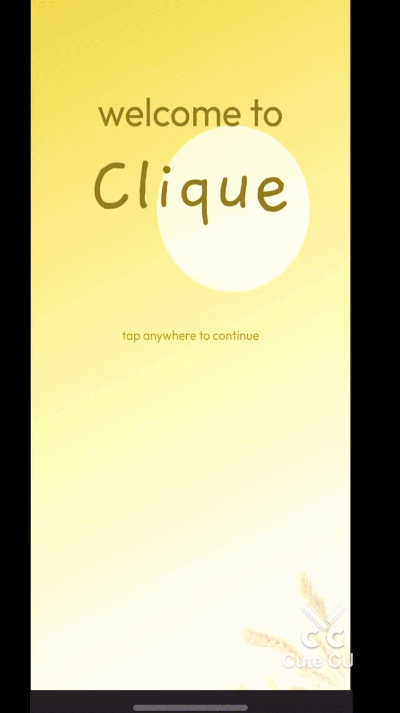
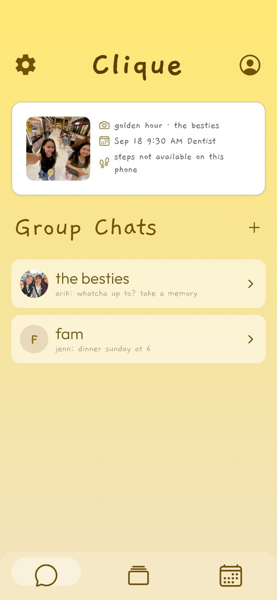
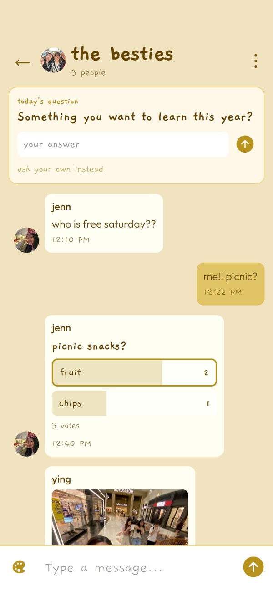
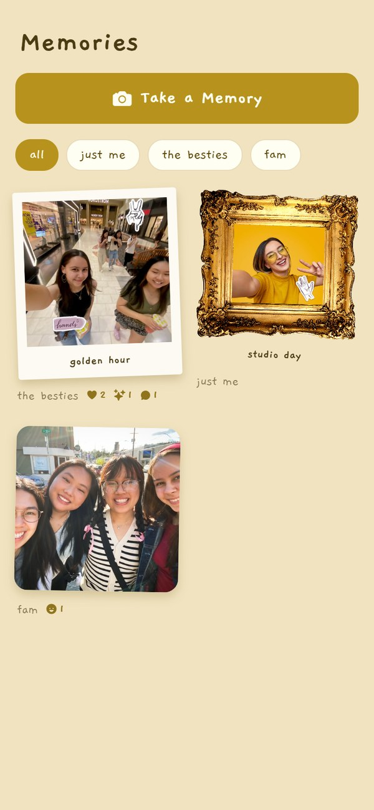
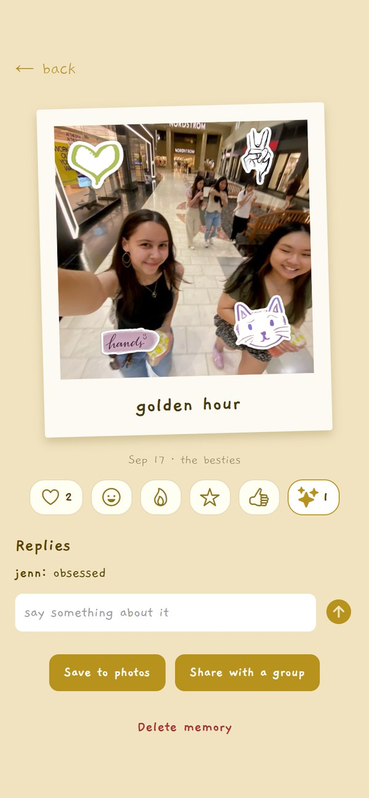
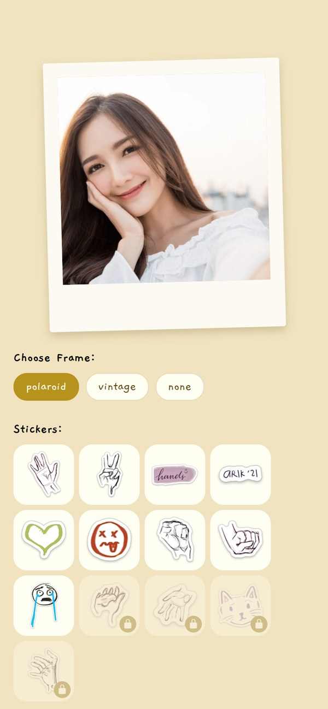
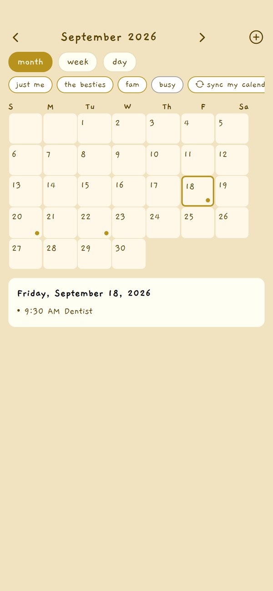

# Clique

   

Clique is a private space for one friend group: a group chat, a shared camera roll, a calendar, and the small planning tools that usually end up scattered across other apps, all in one place. It runs end to end on the phone with no setup, and the same screens move onto Firebase once you add a config.

<p align="center">
  <a href="clique-demo-example.mp4"></a>
</p>

## quickstart

```
git clone https://github.com/arikthehacker/clique.git
cd clique
npm install
npx expo start
```

With no `.env`, Clique starts in local demo mode: sign up, groups, chat, memories, the calendar and the step streak all save on the phone, so you can walk the whole flow in Expo Go without a backend.

expected output:

```
Starting project at .../clique
Starting Metro Bundler

› Metro waiting on exp://<your-ip>:8081
› Scan the QR code above with Expo Go (Android) or the Camera app (iOS)
```

Scan the QR code with Expo Go on a phone, or press `i` for the iOS simulator, `a` for Android, or `w` for web.

## how it works

The screens are thin. The logic worth testing lives in `src/lib` as plain functions over plain data, which is why it can run the same way on the phone or against Firebase.

Find a time intersects each member's shared free windows for the day, then keeps the windows long enough to matter (`src/lib/availability.ts`):

```ts
export function freeWindows(
  members: AvailabilitySlot[][],
  date: string,
  minMinutes: number,
): Window[] {
  if (members.length === 0) return [];

  let common = slotsOn(members[0], date);
  for (const slots of members.slice(1)) {
    common = intersect(common, slotsOn(slots, date));
  }
  return common.filter((window) => window.end - window.start >= minMinutes);
}
```

Your phone's own calendar is read as anonymous busy blocks and subtracted locally, so the busy times never leave the device.

Group bill splitting keeps amounts as integer cents (`src/lib/expenses.ts`): `balances` nets everyone out, and `settleUp` turns those balances into a short "A pays B" list.

## the backend

Everything shared lives under a group, and the Firestore rules follow one rule: group data is for members, personal data is for its owner (`firestore.rules`):

```
function isMember(groupId) {
  return signedIn()
    && request.auth.uid in get(/databases/$(database)/documents/groups/$(groupId)).data.members;
}

match /groups/{groupId} {
  allow read:   if isMember(groupId);
  allow update: if isMember(groupId);
  // messages, polls, todos, questions, expenses and availability nest here
}
```

Photos go to Storage under the uploader's own folder, capped at 10 MB and images only (`storage.rules`). To run on a real backend, copy `.env.example` to `.env`, fill in the Firebase web config, and the same screens use Firebase Auth, Firestore and Storage with these rules.

## features

- Group chat with photo messages, username invites, blocking, reporting and leaving
- Polls, a shared to-do list, a daily question, and group bill splitting
- A memory board: camera capture with frames, hand-drawn stickers saved as positions, reactions and replies, and per-group reminder days
- A calendar with month, week and day views, RSVPs, event templates that drop a checklist into the to-do list, and find-a-time over everyone's free windows
- A step streak that unlocks more sticker sets
- Off the grid, which pauses nudges, and a simple mode with bigger text and tap targets

## screens

| Home | Group chat | Memories |
|---|---|---|
|  |  |  |

| A memory | Stickers | Calendar |
|---|---|---|
|  |  |  |

## tests

79 tests cover the logic in `src/lib`: voting, balances, streaks, free-time overlaps, plans, and input validation.

```
npm test
```

```
Test Suites: 9 passed, 9 total
Tests:       79 passed, 79 total
```

## case study

The design, the user testing and the pitch are written up here: https://www.ariellamarchuk.com/work/clique

I built the MVP in Expo and TypeScript with a business-student partner over six months. She ran the user research; I did the design and the build. We tested with 15 people across five rounds and placed 2nd at the University of Portland Pilot Venture Challenge. The build I presented there is tagged `v1.0-competition`.
